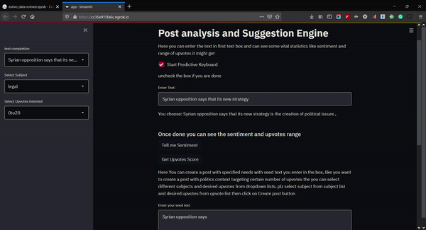

<h1 align="center">Project Insight</h1>

<h2 align="center">Post analysis and Suggestion Models as a Service</h2>

## Contents

1. [Introduction](#section01)
    - [Features](#section01a)
2. [Installation](#section02)
    - [Setup and Documentation](#section02a)
3. [Project Details](#section03)

## Introduction

Project Insight is designed to create NLP as a service with a code base for both front-end GUI (**`streamlit`**)  and Jupyter notebook the usage of transformers models on various downstream NLP task.

The downstream NLP tasks covered:

* Sentence Completion(with seed text and context)

* Upvotes Prediction(Regression/Classification)

* Post Generation(with selected subject and upvotes)

* Sentiment Analysis

* Topic Prediction(Zero-Shot) `To Do`

* Many more thing like NER, Clustering, Ranking, etc could be done

### Features of the solution

* **Python Code Base**: Built using `Transformers` and `Streamlit` making the complete code base in Python. Also, the server could run from the Jupyter notebook without writing any code for deployment and API Creation.
* **Expandable**: The Streamlit framework is designed in a way that code can be expanded and Streamlit also provides us (**`@st.cache`**) that we could use to cache the models which saves us a lot of time and use of more Transformer based models will make the models use in-app more changeable with writing much custom code and it will be available in the front end app automatically. 
* **Micro-Services**: The backend is designed with a microservices architecture, with no dockerfile for any of the services and leveraging notebooks for execution we can run the notebook as a server independently with all models running independently.
    - This makes it easy to update, maintain, start, stop different NLP services.

## Installation

* Clone/Download the Repo.
* Run the `pip install -r requirements.txt ` to install specific versions(won't take much time)
* In the same directory Open the **Eluvio_data_science.ipynb** and run all of the cells

### Setup and Documentation

1. **Download the models**
    - Download the models from [here](https://drive.google.com/drive/folders/1-aeyS6ImGv0nTK3KLGJ0yiYZ1Eh7XPkm?usp=sharing)
    - Save them in your specific model folder.
    
2. **Running the backend service.**
    - Go to the `Eluvio_data_science.ipynb`
    - Run the all of the `Cells`

3. **Running the frontend**
    - It's simple to run(also you already did it)
   
    - After running this 'streamlit run "app.py"' cell
    - Go to the link in just the upper cell's output which should be 'Execute the next cell and go to the following URL: https://649b954f8f89.ngrok.io'
    - Click on this link
    --->
    

## Project Details
1. In this project I tried to create a service like that of a `Predictive keyboard` that google or any other search engine provided which could give us suggestions like we see when we type on a search engine. Why I choose this is because of the dataset it was of Reddit posts with the upvotes, downvotes, and the date it was written so I thought and planned to create a text/sentence completion model which we could take help in writing our post titles. I have also used sentiment analysis and `Upvotes prediction` on the post title that you finalize to write with the model's help this would tell us the sentiment of your post title and what upvotes range it might lie.
2. Generate text from `Predictive keyboard` then either you can (`Generate Sentiment`) of the post or you can see the (`Get Upvotes`) it might get
3. I have also created a `Post title generation model` with given seed text, subject like - `Politics, technology, legal, religion, etc` and upvotes_range that the post should lie in as parameters for the model, and then the model generates the text which could fit those requirements
4. `Predictive keyboard` --> I used GPT-2 model finetuned on the given dataset with 10000+ steps so the model could predict/complete the text with given seed text
5. `Sentiment Analysis` --> Use this text generated from the Predictive keyboard to get the sentiment and score(Probability) of the Post generated used Transformers pipeline
6. `Upvotes Prediction` --> Here I have first divided the upvotes which is numerical data and bin it into `5 Categories 0to20, 20to50, 50to100, 100to250, 250to500` the categories defined as the post might get 0 to 20 upvotes. Why I have used this because of the high variation in the Upvotes 80% of 5000000 are 0 to 20 upvotes so binning is the way to go here. Now for modeling, I have used to convert the text into embeddings with pre-trained `Distill Bert NLI model` and then use these embedding as features in and LightLGBM model. Why I go with this approach is that it's very memory efficient and significantly decreases model training time though I intend to use transformers on it too soon. So if we input the text then it gets converted into an embedding which then becomes a feature for the final prediction of these 5 categories
7. `Post Title Generation` --> And now comes the special part of the project in this I have used Uber-research text generation code and revamp the code and converted it into a model that takes input -> (text: condition text(User enters this), subject:(Politics, technology, legal, religion, etc), Upvotes it should get:(0to20, 20to50, 50to100, 100to250, 250to500) and with these major parameters the model generates the Post title that best fits the requirements. So if you want to create a Post title starting with `"'The US'"` on a subject of `"technology"` which should lie in `"50to100"` upvotes then the model create this text = `" The US Startup is working on a new implementation of GPT-2 Models that could interact with human"` This text changes with the parameters but every text starts with the inputted text i.e `"The US"` in this case.

### Demonstration

